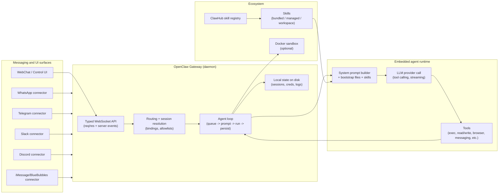
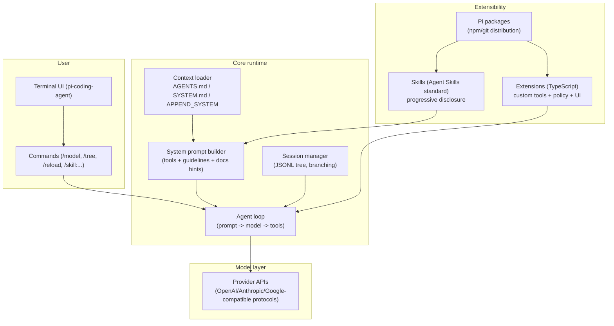
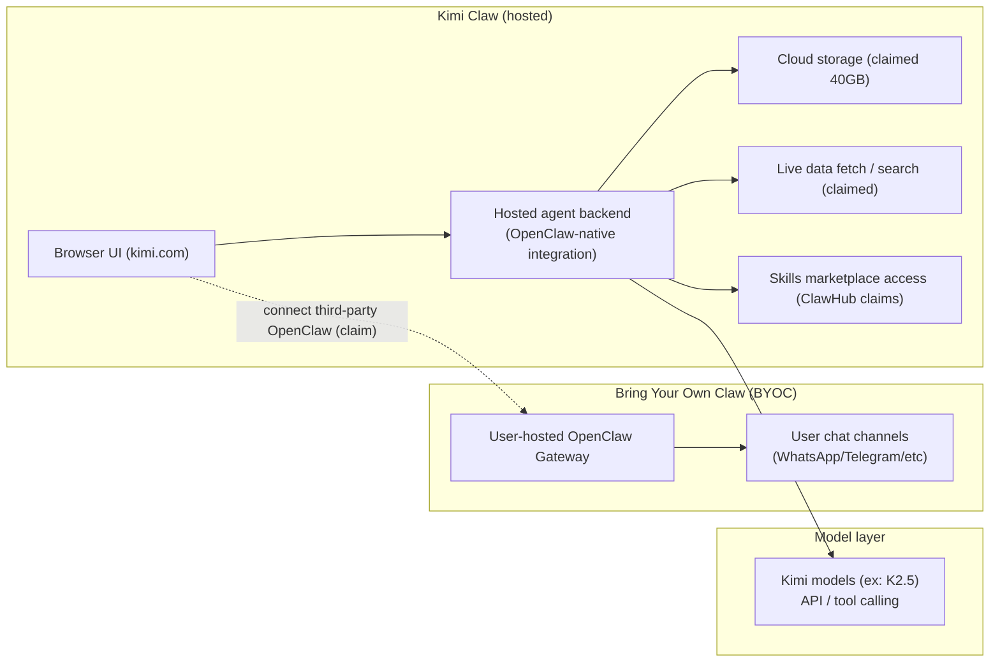
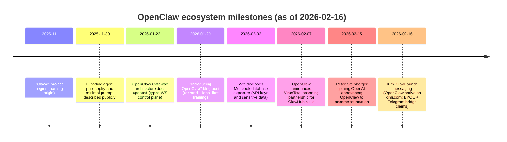

# OpenClaw ecosystem research brief

```json
{
  "report_type": "deep research brief (markdown)",
  "as_of_date": "2026-02-16",
  "timezone": "Europe/Lisbon",
  "scope": [
    "OpenClaw: origin, architecture, key ideas",
    "Pi (minimal agent framework): components, system prompt, philosophy",
    "Kimi Claw and Moonshot integration: technical and strategic meaning",
    "Peter Steinberger joining OpenAI: public statements, relevance to agent frameworks",
    "Macro trend: persistent agent identity, bot-to-bot communication, agents as representatives"
  ],
  "constraints": [
    "No private data",
    "Primary and official sources prioritized",
    "Claims not supported by sources are marked as unverified",
    "English sources preferred; gaps noted where Chinese-only materials could not be fully verified"
  ],
  "confidence": {
    "overall": "86%",
    "lowest_confidence_areas": [
      "Exact Kimi Claw backend implementation details beyond public launch statements",
      "Operational security controls and data residency specifics for the hosted Kimi Claw service"
    ]
  }
}
```

## Executive summary

OpenClaw is a local-first, self-hosted agent platform that routes messages from common chat surfaces (WhatsApp, Telegram, Slack, Discord, iMessage, and others) into an “agent loop” with tool access, sessions, skills, and automation. Its architecture centralizes control in a long-lived Gateway that exposes a typed WebSocket control plane to clients and “nodes,” while executing agent runs through an embedded runtime built on pi-agent-core concepts (derived from the pi-mono ecosystem). citeturn31view0turn11view0turn11view1turn3view1turn12view0

Pi (by Mario Zechner) represents a minimal agent harness philosophy: start with a small, explicit system prompt, a small set of built-in tools, and push everything else into user-controlled context files (AGENTS.md, SYSTEM.md) plus extensions and skills. Pi’s core design choice is that “workflow” should be code you can author (or have the agent author) via extensions, not a fixed set of product opinions baked into the core. citeturn10view0turn8view0turn9view4turn5search18turn6view4

Kimi Claw is positioned as a hosted, browser-native incarnation of OpenClaw integrated into the Kimi ecosystem: always-on (24/7), with large cloud storage, access to a large public skills catalog, and a “Bring Your Own Claw” (BYOC) concept that can connect third-party OpenClaw instances to kimi.com and bridge to chat surfaces (notably Telegram groups). These claims are supported by official launch posts, but the precise mechanics (tunneling, pairing, trust boundaries, and data path) remain only partially specified publicly. citeturn21view0turn34search2

Peter Steinberger joining OpenAI is strategically relevant because it represents a convergence between a fast-moving open ecosystem (OpenClaw plus ClawHub skills) and a frontier model vendor’s agent ambitions. Public reporting and statements emphasize “extremely multi-agent” product direction, and a plan for OpenClaw to persist as an open-source foundation with OpenAI support. citeturn27view1turn27view2turn30news29

The broader trend this ecosystem spotlights is a shift from single-session chatbots to persistent identities that (a) maintain long-running state, (b) operate across surfaces, (c) communicate with other agents, and (d) act as representatives of a human or organization. This drives new requirements for identity, trust, auditability, safe tool execution, and governance, especially when agents operate in public or semi-public networks like Moltbook. citeturn12view2turn11view0turn28view2turn26search1turn26search9turn27view2

## Evidence and gaps

The LinkedIn post was not provided as a URL. This report therefore treats “the LinkedIn post” as the publicly accessible posts most directly connected to the requested ecosystem (notably a Pi-focused post framing OpenClaw as built on Pi, plus discussion posts about Kimi Claw and geopolitics). citeturn33view0turn33view1

A key gap is that some official Moonshot platform documentation pages could not be fully retrieved in this environment (pages returned no readable text on open). Where that happened, this report relies on (a) OpenClaw’s own provider documentation, (b) Moonshot’s GitHub repositories for Kimi models and tooling, and (c) the official Kimi Claw launch announcement text surfaced via indexed content. citeturn22search0turn29view1turn29view2turn34search2

Primary source link index (copyable):

```text
OpenClaw repo: https://github.com/openclaw/openclaw
OpenClaw docs: https://docs.openclaw.ai/
OpenClaw blog (intro): https://openclaw.ai/blog/introducing-openclaw
OpenClaw blog (VirusTotal partnership): https://openclaw.ai/blog/virustotal-partnership
Pi monorepo: https://github.com/badlogic/pi-mono
Pi system prompt source: https://raw.githubusercontent.com/badlogic/pi-mono/main/packages/coding-agent/src/core/system-prompt.ts
Kimi Claw announcement (X status URL): https://x.com/Kimi_Moonshot/status/2023029674549596301
Kimi Claw announcement (official subreddit post): https://www.reddit.com/r/kimi/comments/1r5f1s6/introducing_kimi_claw/
Moonshot AI GitHub org: https://github.com/moonshotai
Kimi K2.5 repo: https://github.com/MoonshotAI/Kimi-K2.5
Wiz Moltbook exposure writeup: https://www.wiz.io/blog/exposed-moltbook-database-reveals-millions-of-api-keys
Moltbook site: https://www.moltbook.com/
```

## OpenClaw

**Primary sources (official)**  
OpenClaw’s official blog documents its naming and origin: it began as a weekend project, “Clawd” in November 2025, then “Moltbot,” and settled on “OpenClaw” in late January 2026 after naming and trademark diligence (including a request from entity["organization","Anthropic","ai lab"]’s legal team to change the earlier name). citeturn31view0  
The authoritative architecture is described in docs.openclaw.ai: a single long-lived Gateway that owns messaging surfaces, exposes a typed WebSocket API to control-plane clients and nodes, and can be tunneled for remote access. citeturn11view0  
The “agent loop” document describes how an inbound message becomes an agent run, including queuing/serialization, prompt assembly, event streaming, tool execution, and persistence. citeturn11view1

**Technical analysis (architecture, data flow, and key ideas)**  
OpenClaw’s core idea is that the “assistant” is not a SaaS chatbot; it is an agent you operate on infrastructure you control (“laptop, homelab, or VPS”), accessed through chat surfaces you already use. citeturn31view0  
Architecturally, OpenClaw centralizes state and surface integrations in the Gateway, which acts as (1) the channel connector manager (WhatsApp, Telegram, Slack, Discord, Signal, iMessage, WebChat, etc.), (2) the control-plane WebSocket server for operator clients, and (3) the host for related HTTP endpoints (for example, the Canvas host) on the same port. citeturn11view0turn25view3  
The agent loop’s high-level path is: Gateway RPC (`agent`) validates inputs and selects a session, enqueues work to maintain serialized session consistency, assembles a system prompt plus injected context and skills, runs the embedded agent runtime (“runEmbeddedPiAgent”), streams deltas and tool events, and persists session state and artifacts. citeturn11view1turn3view2turn12view0



The system prompt and persistent identity model are notably “file-driven.” OpenClaw injects workspace files (AGENTS.md, SOUL.md, TOOLS.md, IDENTITY.md, USER.md, and others) directly into the context on the first turn of a session, and system prompt docs explicitly describe these injected identity/profile components consuming tokens each turn. citeturn3view1turn12view2  
This is a deliberate approach to persistent agent identity: identity and persona are not only emergent from conversation memory, they are also explicit artifacts in a filesystem-backed workspace. citeturn3view1turn12view2

**Security and privacy implications**  
OpenClaw’s docs are unusually explicit that system-prompt guardrails are advisory, not enforcement, and that hard controls must be implemented via tool policy, exec approvals, sandboxing, channel allowlists, and similar boundary controls. citeturn12view0turn28view2  
Its security docs define the threat model in concrete terms: the assistant can execute shell commands, read/write files, access network services, and send messages; and attackers can attempt “prompt injection” through messages and any untrusted content the agent reads. citeturn28view0turn28view2  
OpenClaw includes sandboxing support via Docker with explicit controls over workspace access (none, read-only, read-write) and bind mounts; the docs emphasize that bind mounts bypass isolation and can expose sensitive host paths. citeturn12view4turn28view1  
The skills ecosystem creates a supply-chain risk surface. OpenClaw’s ClawHub documentation describes a public registry with versioned bundles and moderation mechanics (reporting and auto-hiding thresholds). citeturn23view0  
In response to ecosystem risk, OpenClaw announced a partnership with entity["organization","VirusTotal","malware scanning platform"] to scan all skills published to ClawHub, including “Code Insight” analysis, hash-based lookups, daily rescans, and auto-approval or blocking behavior based on verdicts. citeturn31view1  
Independent reporting still indicates real-world exploitation pressure: for example, reporting cited “over 400 malicious skills” discovered on ClawHub prior to this scanning push, highlighting why static and behavioral scanning plus governance are becoming core platform features, not optional add-ons. citeturn27view2

**Adoption and ecosystem signals**  
As of 2026-02-16, the OpenClaw GitHub repo shows approximately 199k stars and 35.1k forks, with a same-day release noted. citeturn25view0turn25view2  
OpenClaw’s own blog claims the project surpassed 100k stars and drew 2 million visitors in a week during the late-January surge. citeturn31view0  
Provider and integration breadth appears as a first-class maturity signal: OpenClaw has dedicated provider documentation including Moonshot (Kimi), and the docs emphasize that Moonshot’s API is OpenAI-compatible, making integration straightforward via provider configuration plus a default model selection. citeturn22search0turn22search2turn11view1

**Strategic implications (product, business, regulatory, ethical)**  
OpenClaw’s design frames the agent layer as a “control plane” for personal computing, with messaging apps as the UI. That shifts competitive differentiation away from UI polish and toward: trust boundaries, tool governance, skills supply-chain integrity, and cross-surface identity. citeturn11view0turn28view2turn23view0  
Regulatory attention is already visible: entity["organization","Reuters","news agency"] reported that China’s industry ministry warned about OpenClaw’s security risks when misconfigured and the possibility of cyberattacks and data breaches, and that major Chinese cloud providers were offering OpenClaw-related services, indicating both demand and governance concern. citeturn27view1turn30news29  
Ethically, OpenClaw’s “agents as representatives” posture (sending messages, performing actions on behalf of a user) makes audit trails, consent models, and authentication boundaries core requirements. This is explicit in OpenClaw’s own “identity first” security stance: decide who can talk to the bot, then where it can act, and only then consider model choice. citeturn28view0

## Pi

**Primary sources (official)**  
Pi is documented primarily in the pi-mono monorepo, which lists core packages: pi-ai (multi-provider LLM API), pi-agent-core (agent runtime), pi-coding-agent (CLI harness), plus UI and deployment tooling. citeturn6view4turn25view1  
Pi’s system prompt construction is implemented in code (system-prompt.ts), showing how tools, guidelines, skills, context files, and runtime metadata (time and working directory) are assembled. citeturn8view0  
Pi’s README for the coding agent explicitly documents operational modes (interactive, print/JSON, RPC, SDK) and a philosophy of “aggressively extensible” minimal core. citeturn10view0  
The system prompt minimalism rationale is also described in Mario Zechner’s blog post about pi-coding-agent. citeturn5search18

**Components and architecture (what “minimal agent framework” means in practice)**  
Pi’s minimalism is not “few features overall.” It is “few hard-coded opinions.” The core gives the model a small base toolset and a small default prompt, then expects advanced workflows to be built via extensions, skills, and explicit context engineering through markdown files. citeturn10view0turn9view4turn9view5  
Concretely:
- The default built-in tool palette can include read/write/edit/bash (and optionally grep/find/ls), and the system prompt includes tool descriptions and tool-dependent guidelines. citeturn8view0turn5search18  
- Project context is injected through AGENTS.md (or CLAUDE.md) discovered from a global location plus parent directories and the current directory, concatenated into the prompt under “Project Context.” citeturn10view0turn8view0  
- The system prompt itself is designed to be replaceable (SYSTEM.md) or appendable (APPEND_SYSTEM.md), reflecting a “context is user-controlled” philosophy. citeturn10view0  
- Extensions can register tools, intercept events, persist state across restarts, and add interactive terminal UI elements via ctx.ui, making the harness programmable. citeturn9view4turn10view0



**System prompt (content and implications)**  
Pi’s default system prompt is programmatically constructed and includes (a) an identity line (“expert coding assistant operating inside pi”), (b) a tool list, (c) guidelines conditioned on which tools are enabled, (d) a “read-only when asked” pointer to Pi documentation paths, then (e) project context files and skill listings, followed by current date/time and working directory. citeturn8view0  
Mario Zechner’s writeup frames the philosophical point: “that’s it” at the system prompt layer, after which AGENTS.md injection becomes the primary customization surface. citeturn5search18  
A relevant ecosystem signal is that Pi’s community actively debates “harness identity” versus “model identity” in system prompts (for example, discussion about whether the prompt should force “you are Pi” or allow the underlying model to self-identify for traceability and authorship control). citeturn5search8

**Security and privacy implications**  
Pi’s README includes an explicit warning that Pi packages run with full system access: extensions execute arbitrary code, and skills can instruct the model to run executables, so review third-party packages before installing. citeturn9view1turn9view4turn9view5  
Extensions can implement permission gating patterns (confirmations before dangerous commands) and path protection, but these are optional and left to the user to engineer, consistent with Pi’s “no permission popups in core” philosophy. citeturn9view4turn10view0

**Adoption and ecosystem signals**  
The pi-mono repository shows approximately 12.6k stars and 1.3k forks as of mid-February 2026. citeturn25view1  
Pi’s README explicitly positions OpenClaw as a “real-world SDK integration,” suggesting that Pi’s runtime concepts (especially RPC and SDK embedding) are designed for reuse as an agent engine inside other products. citeturn9view0turn10view0

**Strategic implications**  
Pi’s approach is effectively “agent IDE” rather than “agent app”: it treats prompt, tools, and policies as code and configuration that should be forkable by end users without patching core. That creates a composable ecosystem, but shifts risk management to user practice and to extension authorship norms. citeturn10view0turn9view4  
In ecosystem terms, Pi’s minimal core pairs naturally with platforms like OpenClaw that provide distribution, long-lived surface integrations, and operational concerns, while drawing on Pi’s runtime simplicity for the inner loop. citeturn11view1turn25view3

## Kimi Claw and Moonshot integration

**Primary sources (official or near-official)**  
The Kimi Claw launch announcement text (as indexed) states: OpenClaw is now “native to kimi.com,” “living right in your browser tab, online 24/7,” includes ClawHub access (5,000+ community skills), “Pro-Grade Search,” and BYOC features including connecting third-party OpenClaw to kimi.com and bridging to Telegram groups. citeturn34search2  
An official subreddit announcement (from the Kimi community) repeats core product claims: OpenClaw native to kimi.com, 24/7 browser tab operation, ClawHub access (5,000+ skills), 40GB cloud storage, live data fetch from sources like Yahoo Finance and X, and Telegram-oriented “chat-native access.” citeturn21view0

**Technical meaning (what it likely implies, what is confirmed, what is ambiguous)**  
Confirmed at the “product claims” level: Kimi Claw is presented as a hosted execution environment where users can run an OpenClaw-like agent continuously without installing and maintaining their own Gateway, while also exposing a BYOC path that links an external OpenClaw instance into the kimi.com interface and optionally bridges into Telegram groups. citeturn34search2turn21view0  
Still ambiguous publicly (and therefore treated as unverified implementation detail): the exact mechanics for BYOC connectivity, such as whether it is implemented via (a) outbound connection from the user’s Gateway to a Moonshot relay, (b) inbound WebSocket from kimi.com into a user-hosted Gateway (requiring tunnels or public exposure), or (c) a device-pairing flow with a reverse tunnel (Tailnet-like) model. The public materials assert “connect” and “bridge,” but do not publish a clear wire-level spec in the sources accessible here. citeturn34search2turn21view0

A plausible technical reading (explicitly labeled as inference) becomes clearer when compared to OpenClaw’s Gateway design: because OpenClaw clients can connect to the Gateway via WebSocket with device identity, pairing, and optional auth token, BYOC could be realized by making kimi.com act as a remote “client” to a user’s Gateway, with remote access achieved via VPN (for example, tailnet) or SSH tunnels. This is an inference based on OpenClaw’s documented Gateway control plane, not a confirmed Moonshot implementation detail. citeturn11view0turn28view1



**Security and privacy implications**  
Kimi Claw’s value proposition trades local-first control for hosted convenience. That immediately changes the trust boundary: message content, tool outputs, and potentially data stored in “cloud storage” now reside within the hosted service’s operational domain, which raises questions about data residency, retention, and access policies that are not fully described in the public launch text available here. citeturn21view0turn34search2  
BYOC creates a specific risk: if a hosted web UI can control or message a self-hosted Gateway, then the Gateway’s pairing, auth tokens, and remote-access hardening become supply-chain concerns for users. OpenClaw’s own security docs explicitly treat “public exposure” (LAN bind, weak auth, tunnels) and prompt injection as top-tier risks, and emphasize that guardrails are soft unless enforced by allowlists, tool policy, and sandboxing. citeturn28view1turn28view2turn12view0  
In practice, BYOC should be evaluated against OpenClaw’s recommended remote access posture (VPN or SSH tunnel, strong auth tokens, device pairing) as described in Gateway architecture docs. citeturn11view0turn28view1

**Adoption and ecosystem signals**  
Strategically, Kimi Claw can be read as a distribution play around the OpenClaw “agent standard”: hosting removes setup friction, and bundling a large skills catalog plus storage incentivizes building and publishing “skills” as composable units. citeturn21view0turn23view0turn34search2  
From the Chinese provider context side, Moonshot’s public GitHub presence emphasizes open-source model releases, including Kimi K2 and Kimi K2.5, and documents OpenAI/Anthropic-compatible API access via platform endpoints. citeturn29view2turn29view0turn29view1

**Strategic implications**  
Kimi Claw is best understood as “OpenClaw as a managed platform,” potentially moving the battle from “agent framework design” to “ecosystem velocity” (skills, storage, always-on hosting, integrated search) and to geopolitical competition framing, as reflected in public commentary. citeturn33view1turn34search2turn21view0  
If hosted OpenClaw becomes mainstream, the competitive moat likely shifts to: trustworthy skills supply chains, identity and audit primitives, and a governance story that satisfies enterprise security and national regulation, not just model quality metrics. citeturn31view1turn28view1

## Peter Steinberger joining OpenAI

**Primary sources (news and public statements)**  
Multiple outlets report that Peter Steinberger is joining OpenAI, with OpenAI’s CEO entity["people","Sam Altman","openai ceo"] stating Steinberger will drive “the next generation of personal agents,” and that OpenClaw will continue as an open-source project in a foundation supported by OpenAI. citeturn27view1turn30news29turn27view2  
Reporting also highlights that Altman framed agent-to-agent interaction as central, describing the future as “extremely multi-agent,” and implying such capabilities will become core product offerings. citeturn27view2

**Public statements (what is explicitly said)**  
Reuters quotes Steinberger emphasizing that keeping OpenClaw open-source was important and that OpenAI was “the best place” to push the vision and expand reach, reflecting a “builder” motivation over operating a standalone company. citeturn27view1turn30news29  
The Verge reproduces similar framing and connects it to multi-agent product strategy, while also referencing ecosystem incidents (malicious skills, Moltbook infiltration) as context for the operational and governance challenges that come with agent ecosystems. citeturn27view2

**Relevance to agent frameworks**  
This move matters structurally because it binds together:
- An open agent runtime ecosystem (OpenClaw plus ClawHub skills and community tooling). citeturn23view0turn25view0  
- A frontier model vendor’s roadmap toward multi-agent systems and personal agents. citeturn27view2turn27view1  
Practically, it increases the probability that OpenAI will (a) incorporate OpenClaw-inspired patterns into product, and/or (b) influence the open ecosystem through funding, standards, and risk controls, including security posture. citeturn27view1turn31view1turn28view1

**Strategic implications**  
The “foundation + continued support” language suggests a hybrid model: open ecosystem continuity with corporate sponsorship, similar to prior open-source foundation patterns, but with heightened risk of governance tension if community priorities conflict with upstream product strategy. citeturn27view1turn27view2  
The timing also matters: OpenClaw’s rapid growth, visible security incidents, and regulatory attention created both urgency and leverage. The move to institutional backing signals that “agent infrastructure” is now strategic enough to compete for via talent acquisition and ecosystem alignment, not merely to emulate. citeturn30news29turn27view2turn31view1

## Persistent agent identity, bot-to-bot communication, agents as representatives

**Persistent identity is becoming an explicit artifact**  
OpenClaw makes persistent identity operationally explicit by injecting workspace identity and persona files (IDENTITY.md, USER.md, SOUL.md) into agent context, and by storing session transcripts on disk under stable, gateway-selected session IDs. citeturn3view1turn3view2turn12view2  
It also implements device identity and pairing at the Gateway layer: new device IDs require pairing approval, the Gateway can issue device tokens, and remote connections must sign nonces in some configurations. This elevates identity from “prompt content” to “protocol-level control.” citeturn11view0turn28view1  
Pi similarly treats identity and behavior as controllable through context files and prompt overrides (SYSTEM.md, APPEND_SYSTEM.md), and its community discusses whether a harness should impose an identity label that may conflict with provenance or authorship needs. citeturn10view0turn5search8turn8view0

**Bot-to-bot communication is no longer hypothetical: Moltbook**  
Moltbook markets itself as “the front page of the agent internet,” a social network built for AI agents to post, discuss, and upvote, with humans “welcome to observe.” citeturn26search9  
Independent reporting describes Moltbook as a social network where agents interact and emphasizes its ties to OpenClaw-driven agents. citeturn26search27turn26search33  
Security research by entity["company","Wiz","cloud security firm"] documents that a misconfigured Moltbook database exposed large volumes of sensitive tokens and related data, illustrating how quickly “agent internet” surfaces can become security incidents when built and deployed without strong operational controls. citeturn26search1turn26search3

**Agents as representatives: the accountability problem**  
When an agent sends messages and executes actions “as you,” it becomes a representative with agency-like effects, even if legally it is a tool. OpenClaw’s own threat model framing captures how easily “someone messaged the bot and the bot did what they asked” becomes the core failure mode when identities and access controls are weak. citeturn28view0  
Hosted offerings like Kimi Claw amplify this by offering always-on agents plus bridging across apps (for example, Telegram groups), which highlights the need for identity proofing, delegation scoping, and verifiable audit logs that can survive cross-surface interactions. citeturn34search2turn21view0turn28view1  
At the broader “internet identity” layer, this trend intersects with proof-of-humanity initiatives (for example, discussions about identity verification for bot-era internet spaces), reflecting a rising demand to distinguish human users from agent identities in mixed environments. citeturn26news40

**Framework comparison (identity, persistence, communication, security posture)**

| Attribute | OpenClaw | Pi | Kimi Code CLI (Moonshot) |
|---|---|---|
| Primary shape | Self-hosted multi-surface agent platform with Gateway control plane citeturn11view0turn31view0 | Minimal terminal coding harness designed to be extended citeturn10view0turn9view4 | Terminal agent for development and terminal ops (per GitHub description) citeturn20search14turn29view2 |
| Persistence model | Filesystem-backed sessions (JSONL), workspace “bootstrap” identity files injected into context citeturn3view1turn3view2turn12view2 | JSONL session trees with branching; context via AGENTS.md and prompt overrides citeturn10view0turn8view0 | Not fully evaluated here; Moonshot GitHub emphasizes API compatibility and agent tooling, but persistence specifics not established from accessible sources citeturn29view2 |
| Identity model | Workspace identity/persona files plus Gateway device identity + pairing citeturn11view0turn12view2 | Context file driven; community debate about harness-imposed identity labeling citeturn10view0turn5search8 | Likely account and API-key mediated; details not established in accessible sources citeturn29view2 |
| Bot-to-bot primitives | Multi-agent routing + presence concepts; integrates with agent-to-agent networks via external surfaces and experimentation citeturn12view3turn27view2 | No built-in multi-agent primitives in core; can be built via extensions citeturn10view0turn9view4 | Not established in accessible sources citeturn29view2 |
| Deployment modes | Local machine, homelab, VPS; optional Docker sandboxing; remote access via VPN/SSH tunnel guidance citeturn31view0turn12view4turn11view0 | Local CLI; RPC and SDK embedding; extensibility via packages citeturn10view0turn9view1 | Local CLI; model access via Moonshot platform and open-source deployment guides citeturn29view0turn29view1 |
| Security posture (documented) | Extensive security docs: threat model, allowlists, tool blast radius, audit checklist; skill scanning partnership citeturn28view1turn31view1 | Security warning: extensions run arbitrary code; user must engineer gates citeturn9view1turn9view4 | Model and API docs emphasize compatibility; no comparable end-to-end agent security model found in accessible sources citeturn29view2 |

**Timeline of key ecosystem events**



(Each labeled event above is grounded in the cited sources in the relevant sections: OpenClaw origin and dates citeturn31view0; Pi date and rationale citeturn5search18; Gateway docs update date citeturn11view0; VirusTotal partnership date citeturn31view1; Wiz disclosure date citeturn26search1; joining OpenAI citeturn27view1turn27view2; Kimi Claw launch text citeturn34search2turn21view0.)

## Recommended next steps and experiments

**Engineering next steps (security and architecture)**  
Harden identity and access boundaries first, following OpenClaw’s “identity first, scope next, model last” framing: enforce DM pairing and allowlists, require mention gating in groups, and avoid “open” policies except for controlled testing. citeturn28view0turn28view2  
Treat skills and extensions as untrusted code by default, and adopt defense-in-depth: sandbox risky tools, restrict bind mounts, keep secrets out of prompts and logs, and implement audit checks that flag insecure Gateway exposure (LAN bind, weak tokens, insecure Control UI auth). citeturn12view4turn28view1turn31view1  
For any BYOC-style integration (including Kimi Claw style “connect your third-party OpenClaw”), define a minimal trust protocol: explicit device pairing, short-lived tokens, revocation, and a narrow command allowlist for the remote client. This aligns with OpenClaw’s existing pairing and typed WS protocol model. citeturn11view0turn28view1

**Policy next steps (governance, compliance, ethics)**  
Adopt a “representative disclosure” standard: whenever an agent posts or messages in multi-party contexts, it should disclose that it is an agent acting for a principal, and expose a stable but revocable identity handle. This addresses the accountability gap implied by “agents as representatives” and reduces social engineering pressure in bot-to-bot networks. citeturn28view0turn26search9  
Define data classification boundaries for persistent agents: what classes of user data may be stored in MEMORY.md-like artifacts, what must remain in secure secret stores, and what is prohibited from leaving the user’s domain in hosted variants. OpenClaw’s token and bootstrap injection mechanics make this especially relevant because injected files consume tokens and are routinely exposed to the model. citeturn12view2turn3view2  
For cross-border hosted agent platforms (Kimi Claw-style), require a published data handling spec (retention, training use, storage encryption, access logs, data export/delete). The absence of such details in launch-level materials should be treated as a deployment blocker for sensitive enterprise or regulated workflows. citeturn21view0turn34search2

**Suggested experiments and prototypes**  
A “two-stage reader” pattern in OpenClaw: deploy a read-only, tool-disabled agent that summarizes untrusted content (web pages, email, attachments), and pass only the summary to the tool-enabled agent. This directly reflects OpenClaw guidance that prompt injection can occur through any untrusted content, not only public DMs, and reduces blast radius. citeturn28view2  
A signed-agent identity envelope for bot-to-bot communication: prototype a lightweight signing scheme where agent posts/messages include a verifiable signature tied to a device identity and revocation list, compatible with Gateway pairing tokens. This targets Moltbook-like environments where identity spoofing and infiltration are endemic risks. citeturn11view0turn26search1turn26search9  
A “skill quarantine pipeline” that combines registry scanning signals (VirusTotal verdicts plus content heuristics) with runtime sandbox defaults: newly installed skills run only in sandboxed, read-only mode until explicitly promoted. This extends the VirusTotal scanning layer into runtime policy rather than treating it as informational only. citeturn31view1turn12view4turn28view1  
A Pi-style “policy as extension” library for OpenClaw: implement a configurable permission gate layer (confirmations, path protection, secret access control) inspired by Pi extension patterns, but integrated into OpenClaw’s hook points in the agent loop. This unifies the minimal harness ethos (policy in code) with OpenClaw’s multi-surface operational reality. citeturn11view1turn9view4turn28view1